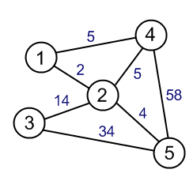
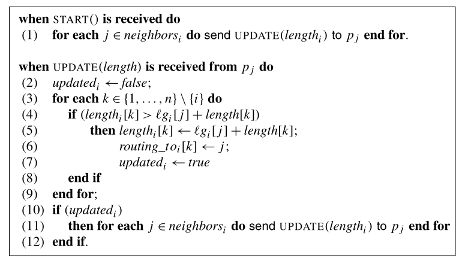

# Distributed Bellman-Ford Algorithm

An implementation of Bellman-Ford's shortest path finding algorithm on a distributed system, following the definition put forward by Michel Raynal in _Distributed Algorithm's for Message Passing Systems._

### Example graph:

- The communication channels are bidirectional; i.e., `{1, 2}` and `{2, 1}` represent the same channel.
- The communication channels are positive in length/weight.

### Raynal's psuedocode:

